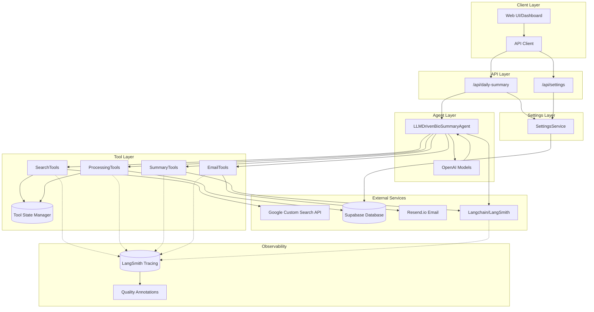
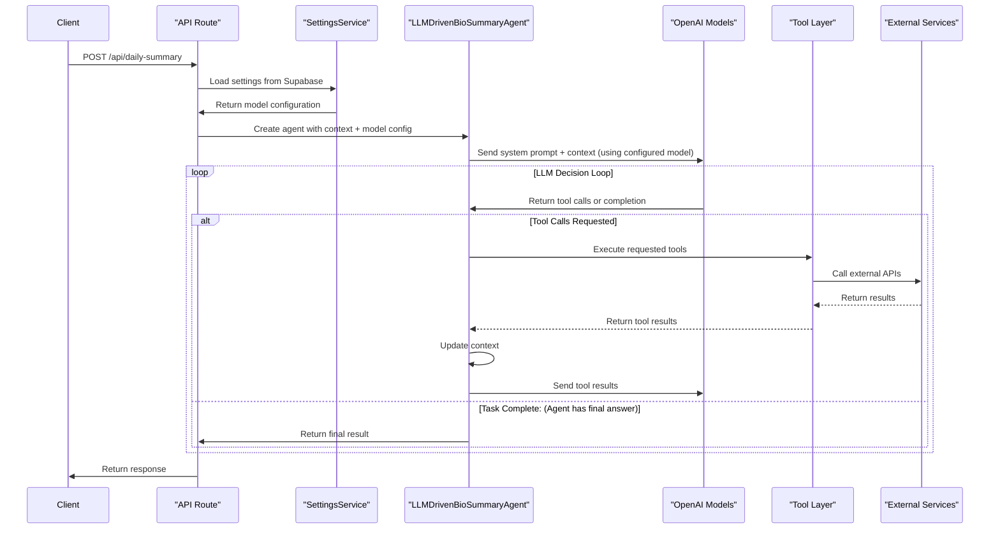
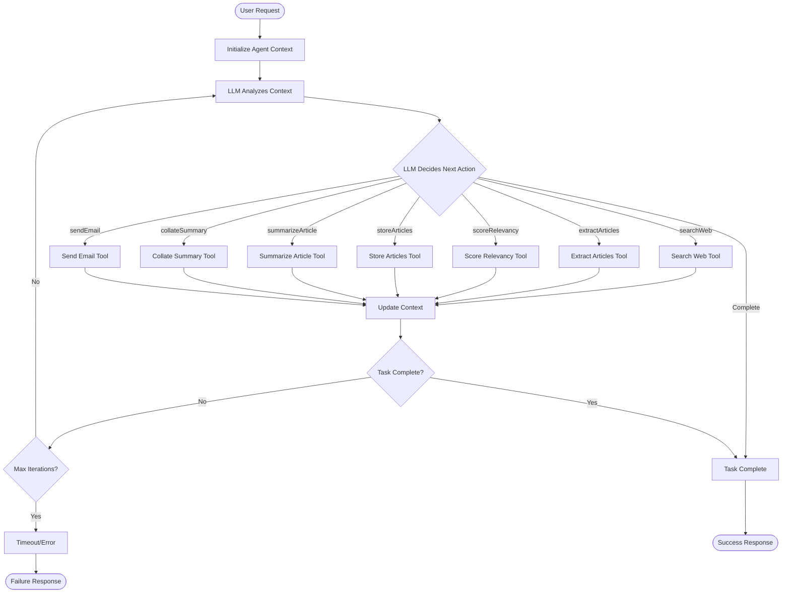
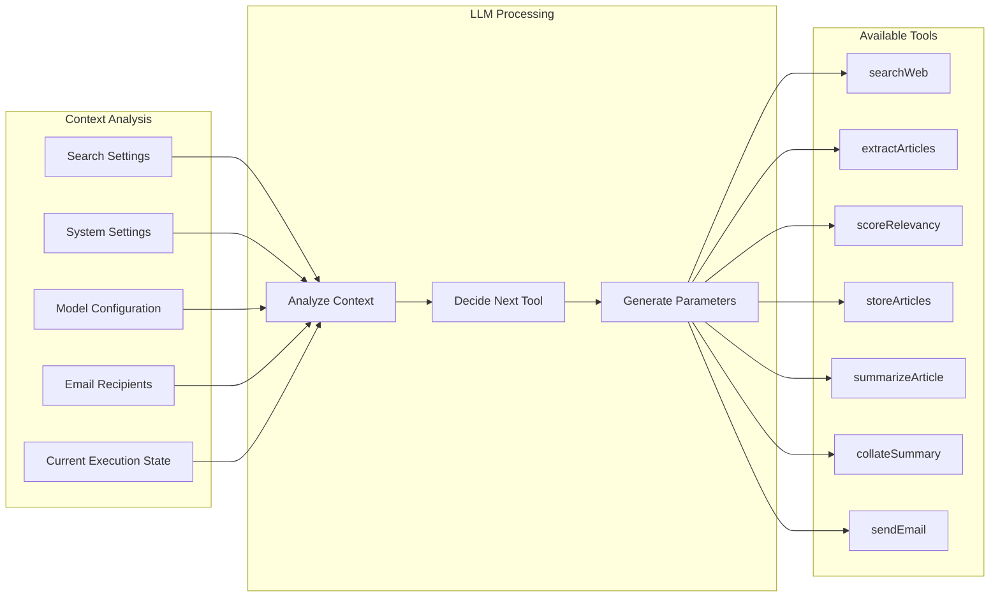
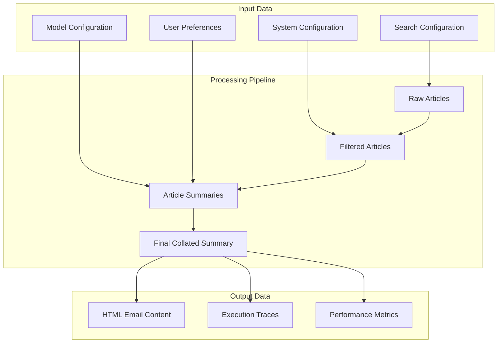
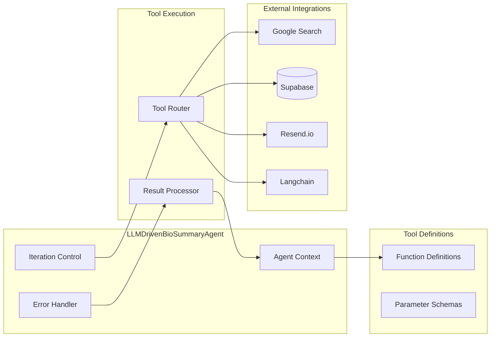

# Agent Bio Summary V2 - LLM-Driven Architecture Diagram

## 🏗️ System Architecture Overview



## 🔄 LLM-Driven Execution Flow



## 🛠️ Tool Execution Flow



## 🧠 LLM Decision Making Process



## 📊 Data Flow Architecture



## 🔧 Component Interaction Details



## 🚀 Key Architectural Features

### **1. LLM-Driven Decision Making**
- Configurable OpenAI models make intelligent decisions about tool sequence
- Context-aware execution based on current state and model configuration
- Dynamic adaptation to different scenarios
- Model selection from Supabase settings

### **2. Tool Abstraction Layer**
- Clean separation between LLM decisions and tool execution
- Standardized tool interface with OpenAI function definitions
- Type-safe parameter validation

### **3. Context Management**
- Persistent context throughout execution
- State tracking for each processing step
- Error recovery and retry mechanisms

### **4. External Service Integration**
- Google Custom Search for article discovery (with pagination support)
- Supabase for data persistence and model configuration
- Resend.io for email delivery
- Langchain for advanced LLM operations

### **5. Configurable Model System**
- Dynamic model selection from Supabase settings
- Temperature and token limit configuration
- Fallback to default settings if database unavailable
- Support for multiple OpenAI models (GPT-4o, GPT-4o-mini, etc.)

### **6. State Management for Tools**
- Session-based in-memory state cache
- Enables data sharing between tools without token overhead
- Prevents JSON truncation errors with large payloads (100+ search results)
- Automatic cleanup on completion/error
- Isolated state per execution session

### **7. Monitoring & Observability**
- Comprehensive logging at each step
- Session tracking and execution metrics
- Error tracking and recovery logging

## 📈 Performance Characteristics

- **Execution Time**: 30-60 seconds per summary (varies by model)
- **Cost**: ~$0.02-0.50 per execution (configurable via model selection)
  - Evaluation cost: +$0.20/month for ~10 articles/day
- **Success Rate**: High with proper API configuration
- **Scalability**: Horizontal scaling via stateless design
- **Reliability**: Built-in error handling and retry logic
- **Model Flexibility**: Dynamic model selection for cost/quality optimization

## 🔍 Observability Architecture (Week 1 & 2 - Implemented)

### LangSmith Integration
```
All Operations → LangSmith Tracing
├── Tool Executions (Custom TracingWrapper)
│   ├── searchWeb: query, results, duration
│   ├── extractArticles: article count, extraction time
│   ├── scoreRelevancy: threshold, relevant count
│   ├── storeArticles: database operations
│   └── sendEmail: recipients, delivery status
│
└── LangChain Operations (Auto-Traced)
    ├── Summarization: article → summary (GPT-4o)
    ├── Collation: summaries → newsletter (GPT-4o)
    ├── Evaluation: summary → quality score (GPT-4o-mini)
    └── Collated Evaluation: newsletter → quality score (GPT-4o-mini)

Quality Scores → Annotations (Linked to Traces)
├── Individual Summary: coherence, accuracy, completeness, readability
└── Collated Newsletter: overall quality metrics
```

### Tracing Characteristics
- **Coverage**: 100% of tool and LLM operations
- **Overhead**: < 50ms per operation (async tracing)
- **Cost**: Free tier (< 5K traces/month)
- **Granularity**: Inputs, outputs, duration, success/failure, metadata
- **Annotations**: Quality scores (0-1 scale) with pass/fail threshold (0.5)

## 🗂️ State Management Pattern

### Problem Statement
LangChain tools are stateless by design. When the LLM needs to pass data between tools, it must serialize the data as JSON in function arguments. With 100 search results, this creates a ~14KB payload that exceeds token limits, causing JSON truncation and parsing errors.

### Solution: Session-Based State Cache

**Architecture:**
```typescript
ToolStateManager (Singleton)
├── Session Map: { sessionId → ToolState }
│   ├── "session_123": {
│   │     searchResults: [100 articles],
│   │     extractedArticles: [...],
│   │     summaries: [...]
│   │   }
│   └── "session_456": { ... }
└── Lifecycle: 
    ├── Created: Agent start (setToolSessionId)
    ├── Used: Tools read/write during execution
    └── Destroyed: Agent completion (clearState)
```

**Data Flow:**
```
1. searchWeb(query, maxResults: 100)
   ├── Fetches 100 results via pagination
   ├── Stores in state: toolStateManager.updateState(sessionId, { searchResults })
   └── Returns: { count: 100, message: "Found 100 articles" } ← Small payload

2. LLM sees: "Found 100 articles in state"
   └── Calls: extractScoreAndStoreArticles(relevancyThreshold: 0.8) ← Tiny payload

3. extractScoreAndStoreArticles()
   ├── Reads: state.searchResults (100 articles)
   ├── Processes all 100 articles
   └── Stores results back in state
```

**Benefits:**
- ✅ Eliminates JSON truncation errors
- ✅ Reduces token usage (LLM doesn't re-serialize large arrays)
- ✅ Faster execution (no JSON parsing overhead)
- ✅ Session isolation (parallel runs don't interfere)
- ✅ Automatic cleanup (no memory leaks)

**Trade-offs:**
- ⚠️ In-memory only (lost on server restart)
- ⚠️ Not shared across Vercel instances (OK for single-instance deployments)
- ⚠️ Additional complexity (state management layer)

### Google Custom Search API Pagination

**Constraints:**
- Maximum 10 results per request
- Maximum 100 results total (API hard limit)

**Implementation:**
```typescript
// User sets: maxResults = 100
// System makes 10 paginated requests:
for (let i = 0; i < 10; i++) {
  fetch(`...&num=10&start=${i * 10 + 1}`)
  // Request 1: results 1-10
  // Request 2: results 11-20
  // ...
  // Request 10: results 91-100
}
```

**Validation Layers:**
1. **UI**: `<input max="100" />` + JavaScript validation
2. **Backend**: `Math.min(dbValue, 100)` when reading from Supabase
3. **API**: SearchTools caps pagination at 100

This architecture provides a robust, intelligent, and fully observable solution for automated bio summary generation using LLM-driven tool calling with comprehensive quality tracking and efficient state management.
