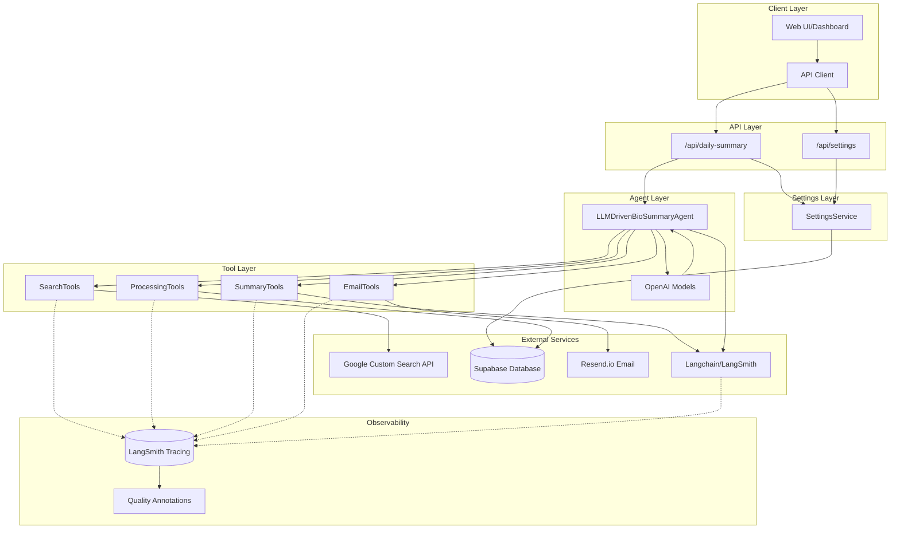

# Agent Bio Summary V2 - LLM-Driven Architecture Diagram

## 🏗️ System Architecture Overview



## 🔄 LLM-Driven Execution Flow


## 🛠️ Tool Execution Flow


## 🧠 LLM Decision Making Process


## 📊 Data Flow Architecture


## 🔧 Component Interaction Details


## 🚀 Key Architectural Features

### **1. LLM-Driven Decision Making**
- Configurable OpenAI models make intelligent decisions about tool sequence
- Context-aware execution based on current state and model configuration
- Dynamic adaptation to different scenarios
- Model selection from Supabase settings

### **2. Tool Abstraction Layer**
- Clean separation between LLM decisions and tool execution
- Standardized tool interface with OpenAI function definitions
- Type-safe parameter validation

### **3. Context Management**
- Persistent context throughout execution
- State tracking for each processing step
- Error recovery and retry mechanisms

### **4. External Service Integration**
- Google Custom Search for article discovery
- Supabase for data persistence and model configuration
- Resend.io for email delivery
- Langchain for advanced LLM operations

### **5. Configurable Model System**
- Dynamic model selection from Supabase settings
- Temperature and token limit configuration
- Fallback to default settings if database unavailable
- Support for multiple OpenAI models (GPT-4o, GPT-4o-mini, etc.)

### **6. Monitoring & Observability**
- Comprehensive logging at each step
- Session tracking and execution metrics
- Error tracking and recovery logging

## 📈 Performance Characteristics

- **Execution Time**: 30-60 seconds per summary (varies by model)
- **Cost**: ~$0.02-0.50 per execution (configurable via model selection)
  - Evaluation cost: +$0.20/month for ~10 articles/day
- **Success Rate**: High with proper API configuration
- **Scalability**: Horizontal scaling via stateless design
- **Reliability**: Built-in error handling and retry logic
- **Model Flexibility**: Dynamic model selection for cost/quality optimization

## 🔍 Observability Architecture (Week 1 & 2 - Implemented)

### LangSmith Integration
```
All Operations → LangSmith Tracing
├── Tool Executions (Custom TracingWrapper)
│   ├── searchWeb: query, results, duration
│   ├── extractArticles: article count, extraction time
│   ├── scoreRelevancy: threshold, relevant count
│   ├── storeArticles: database operations
│   └── sendEmail: recipients, delivery status
│
└── LangChain Operations (Auto-Traced)
    ├── Summarization: article → summary (GPT-4o)
    ├── Collation: summaries → newsletter (GPT-4o)
    ├── Evaluation: summary → quality score (GPT-4o-mini)
    └── Collated Evaluation: newsletter → quality score (GPT-4o-mini)

Quality Scores → Annotations (Linked to Traces)
├── Individual Summary: coherence, accuracy, completeness, readability
└── Collated Newsletter: overall quality metrics
```

### Tracing Characteristics
- **Coverage**: 100% of tool and LLM operations
- **Overhead**: < 50ms per operation (async tracing)
- **Cost**: Free tier (< 5K traces/month)
- **Granularity**: Inputs, outputs, duration, success/failure, metadata
- **Annotations**: Quality scores (0-1 scale) with pass/fail threshold (0.5)

### Current Limitations (Fixed in Week 3)
- ❌ Traces are flat (not hierarchical tree)
- ❌ No parent agent run linking child tools
- ✅ Workaround: Filter by session ID in dashboard

### Future Enhancements (Week 3+)
- ✅ Hierarchical traces (parent agent → child tools)
- ✅ Visual workflow tree in LangSmith
- ✅ Automatic parent-child linking via LangChain Agent
- ✅ Prompt versioning and A/B testing (Week 4)

This architecture provides a robust, intelligent, and fully observable solution for automated bio summary generation using LLM-driven tool calling with comprehensive quality tracking.
