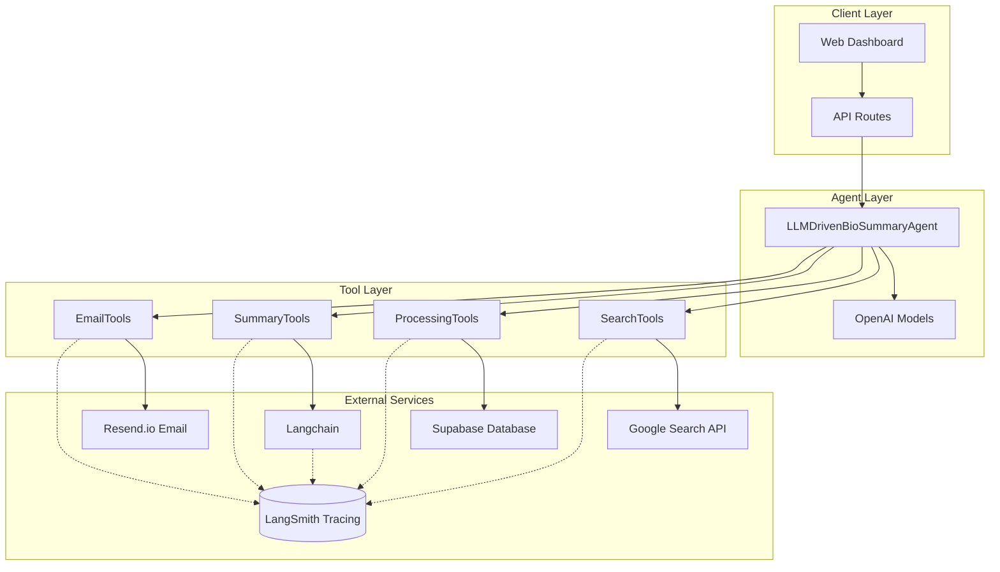

# Agent Bio Summary V2 - LLM-Driven Bio Summary Agent

## 🧬 Overview

Agent Bio Summary V2 is an intelligent, agentic system that automatically generates daily synthetic biology and biotechnology summaries using LLM-driven tool calling. Built on OpenAI's Agent SDK with Langchain integration, it provides automated article discovery, intelligent summarization, and personalized email delivery. This system was designed to educate motivated high school students on advances and applications of synthetic biology. 

## 🚀 Key Features

### **LLM-Driven Intelligence**
- **OpenAI Agent SDK**: Intelligent decision-making using configurable OpenAI models
- **Tool Calling**: Dynamic tool selection based on context and requirements
- **Model Flexibility**: Support for GPT-4o, GPT-4o-mini, and other OpenAI models
- **Context Awareness**: Maintains state throughout the entire execution process

### **Automated Workflow**
- **Smart Article Discovery**: Google Custom Search API with site-specific filtering
- **Intelligent Summarization**: 100+ word summaries with LLM-as-a-judge quality assessment
- **Relevance Scoring**: Automated article filtering based on synthetic biology relevance
- **Email Delivery**: Professional HTML email templates via Resend.io

### **Advanced Capabilities**
- **LangSmith Tracing**: 100% observability - all tool executions and LLM operations traced
- **LLM-as-a-Judge**: Automatic quality evaluation (GPT-4o-mini) for every summary
- **Quality Annotations**: Eval scores (0-1 scale) linked to traces for trend tracking
- **Langchain Integration**: Centralized prompt management (migrating to Hub in Week 4)
- **Cost Tracking**: Automatic cost and token tracking per operation (~$0.20/month for evals)

## 🏗️ Architecture

### **System Components**



### **Execution Flow**

1. **Context Loading**: Retrieve search settings, system configuration, and email recipients from Supabase
2. **Agent Initialization**: Create LLM-driven agent with loaded context and model configuration
3. **Intelligent Execution**: LLM decides tool sequence based on context and requirements
4. **Tool Calling**: Execute tools for search, processing, summarization, and email delivery
5. **Result Delivery**: Return comprehensive execution results with traces and metrics

## 🛠️ Tool Ecosystem

### **Search & Discovery**
- **`searchWeb`**: Intelligent web search using Google Custom Search API
- **`extractArticles`**: Article extraction with time window and source filtering
- **`scoreRelevancy`**: Article filtering with relevance scoring for synthetic biology content

### **Processing & Storage**
- **`storeArticles`**: Database storage with relevance threshold filtering (max 10 articles)
- **`summarizeArticle`**: Individual article summarization with quality requirements
- **`collateSummary`**: Intelligent summary combination with HTML formatting

### **Delivery & Communication**
- **`sendEmail`**: Professional email delivery via Resend.io with HTML templates
- **`trackPerformance`**: Execution monitoring and performance metrics


## 📊 Performance Characteristics

- **Execution Time**: 30-60 seconds per summary (varies by model selection)
- **Cost**: $0.02-0.50 per execution (configurable via model selection)
  - Evaluation overhead: +$0.20/month for quality tracking (~10 articles/day)
- **Success Rate**: High with proper API configuration
- **Scalability**: Horizontal scaling via stateless design
- **Reliability**: Built-in error handling and retry logic

## 🔍 Observability & Quality Tracking

### **LangSmith Tracing** ✅ (Week 1 & 2 Complete)
- **Full Coverage**: All tool executions and LLM operations traced
- **Dashboard**: https://smith.langchain.com (filter by project: `agent-bio-summary-v2`)
- **Metadata**: Duration, inputs, outputs, success/failure for every operation
- **Cost Tracking**: Automatic token and cost calculation per trace

### **LLM-as-a-Judge Evaluation** ✅ (Implemented)
- **Auto-Evaluation**: Every summary scored by GPT-4o-mini
- **4 Metrics**: Coherence, accuracy, completeness, readability (0-1 scale)
- **Pass/Fail**: Threshold at 0.5 (summaries < 0.5 filtered out)
- **Annotations**: Quality scores linked to traces in LangSmith
- **Cost**: ~$0.0003 per evaluation (~$0.20/month for daily summaries)

### **Quality Dashboard Insights**
- Track quality trends over time
- Identify low-performing summaries
- Compare prompt versions (coming in Week 4)
- Monitor evaluation accuracy

## 🧪 Testing

### **Test Suite**

```bash
# Unit tests
npm test

# Integration tests
npm run test:integration

# End-to-end tests
npm run test:e2e
```

### **Test Coverage**

- **Unit Tests**: Individual component testing with mocked dependencies
- **Integration Tests**: External service connectivity and API validation
- **E2E Tests**: Complete workflow testing with real external services


## 📚 Documentation

- **[Architecture Specification](./ABS%20V2%20-%20Architecture%20Spec.md)**: Detailed system architecture
- **[Design Specification](./ABS%20V2%20-%20Design%20Spec.md)**: Component design and implementation
- **[Implementation Plan](./ABS%20V2%20-%20Implementation%20Plan.md)**: Development roadmap
- **[Testing Guide](./TESTING.md)**: Comprehensive testing documentation
- **[Integration Testing](./INTEGRATION-TESTING-PLAN.md)**: External service testing
