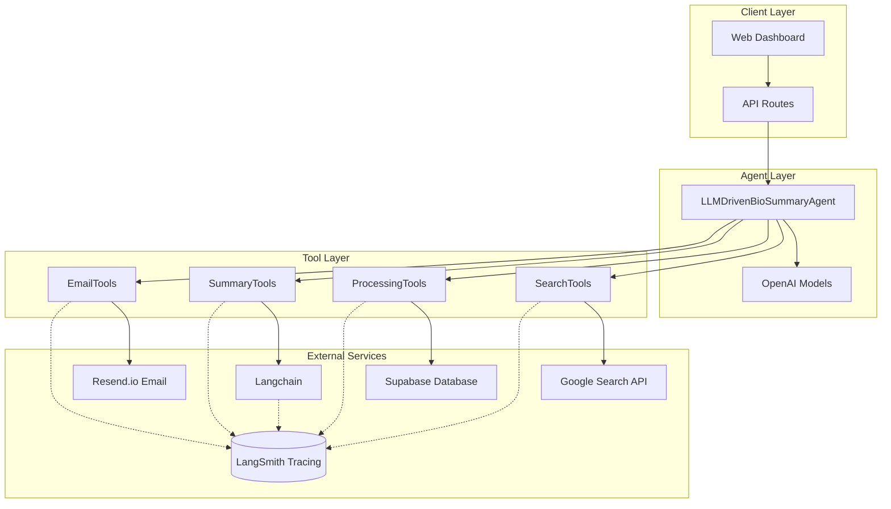

# Agent Bio Summary V2 - LLM-Driven Bio Summary Agent

## 🧬 Overview

Agent Bio Summary V2 is an intelligent, agentic system that automatically generates daily synthetic biology and biotechnology summaries using LLM-driven tool calling. Built on OpenAI's Agent SDK with Langchain integration, it provides automated article discovery, intelligent summarization, and personalized email delivery. This system was designed to educate motivated high school students on advances and applications of synthetic biology.


## 🚀 Key Features

### **LLM-Driven Intelligence**
- **LangChain AgentExecutor**: Intelligent decision-making with automatic tool orchestration
- **Tool Calling**: Dynamic tool selection based on context and requirements
- **Model Flexibility**: Support for GPT-4o, GPT-4o-mini, and other OpenAI models
- **Context Awareness**: Maintains state throughout the entire execution process
- **Hub-Managed Prompts**: All 5 prompts versioned and managed in LangSmith Hub

### **Automated Workflow**
- **Smart Article Discovery**: Google Custom Search API with site-specific filtering
- **Intelligent Summarization**: 100+ word summaries with LLM-as-a-judge quality assessment
- **Relevance Scoring**: Automated article filtering based on synthetic biology relevance
- **Email Delivery**: Professional HTML email templates via Resend.io

### **Advanced Capabilities**
- **LangSmith Hub Integration**: All 5 prompts managed centrally in LangSmith Hub
  - Agent orchestration prompt (controls workflow)
  - Summarization, collation, and evaluation prompts
  - Version control, A/B testing, and experimentation without deployments
- **LangSmith Tracing**: 100% observability - all tool executions and LLM operations traced
- **LLM-as-a-Judge**: Automatic quality evaluation for every summary
- **Quality Annotations**: Eval scores (0-1 scale) linked to traces for trend tracking
- **Cost Tracking**: Automatic cost and token tracking per operation (~$0.20/month for evals)
- **Session-Based State Management**: Efficient data sharing between tools without token overhead

## 🏗️ Architecture

### **System Components**



### **Execution Flow**

1. **Context Loading**: Retrieve search settings, system configuration, and email recipients from Supabase
2. **Agent Initialization**: Create LLM-driven agent with loaded context and model configuration
3. **Intelligent Execution**: LLM decides tool sequence based on context and requirements
4. **Tool Calling**: Execute tools for search, processing, summarization, and email delivery
5. **Result Delivery**: Return comprehensive execution results with traces and metrics

## 🛠️ Tool Ecosystem

### **Search & Discovery**
- **`searchWeb`**: Google Custom Search API with pagination (up to 100 results via 10 paginated requests)
  - Automatically stores results in session state
  - Returns lightweight summary to avoid token limits
  - Implements rate limiting and graceful fallback
- **`extractScoreAndStoreArticles`**: **PREFERRED** - Combined tool that reads from state
  - Extracts full article content from URLs
  - Scores articles for synthetic biology relevancy
  - Stores relevant articles (score >= threshold) in database
  - Single efficient operation instead of three separate tools

### **Legacy Tools** (Individual Operations)
- **`extractArticles`**: Extract full content from URLs (use combined tool instead)
- **`scoreRelevancy`**: Score articles for relevance (use combined tool instead)
- **`storeArticles`**: Database storage (use combined tool instead)

### **Content Generation**
- **`summarizeArticle`**: Individual article summarization with quality requirements
- **`collateSummary`**: Intelligent summary combination with HTML formatting

### **Delivery & Communication**
- **`sendEmail`**: Professional email delivery via Resend.io with HTML templates


## 📊 Performance Characteristics

- **Execution Time**: 30-60 seconds per summary (varies by model selection)
- **Cost**: $0.02-0.50 per execution (configurable via model selection)
- Evaluation overhead: +$0.20/month for quality tracking (~10 articles/day)


## 🧩 State Management Architecture

### **Session-Based Tool State** ✅
- **Purpose**: Share large data between tools without exceeding token limits
- **Implementation**: In-memory state manager with session isolation
- **Benefits**: 
  - Avoids JSON truncation errors when passing 100+ search results
  - Reduces LLM token usage (no need to copy-paste large payloads)
  - Faster execution (no serialization overhead)
- **Lifecycle**: Created at agent start → populated by tools → cleared at completion
- **Isolation**: Each session (daily run) has independent state

### **Data Flow**
```
searchWeb → stores 100 results in state → returns "Found 100 articles"
         ↓
extractScoreAndStore → reads 100 results from state → processes them
```

### **Search API Limits**
- **Google Custom Search**: 10 results per request, 100 results maximum
- **Pagination**: Automatic (up to 10 requests to fetch 100 results)
- **UI Validation**: Max articles capped at 100 with client-side validation
- **Backend Validation**: Settings service enforces 100 limit when reading/writing

## 🔍 Observability & Quality Tracking

### **LangSmith Tracing** ✅ 
- **Full Coverage**: All tool executions and LLM operations traced
- **Dashboard**: https://smith.langchain.com (filter by project: `agent-bio-summary-v2`)
- **Metadata**: Duration, inputs, outputs, success/failure for every operation
- **Cost Tracking**: Automatic token and cost calculation per trace

### **LLM-as-a-Judge Evaluation** ✅ 
- **Auto-Evaluation**: Every summary scored by GPT-4o-mini
- **Pass/Fail**: Threshold at 0.5 (summaries < 0.5 filtered out)
- **Annotations**: Quality scores linked to traces in LangSmith
- **Cost**: ~$0.0003 per evaluation (~$0.20/month for daily summaries)

### **Quality Dashboard Insights**
- Track quality trends over time
- Identify low-performing summaries
- Compare prompt versions across experiments
- Monitor evaluation accuracy

## 🎯 LangSmith Hub Prompts

All prompts are managed in LangSmith Hub for easy versioning and experimentation:

### **Prompt Management**
1. **`orchestration`** - Agent system prompt (controls tool calling workflow)
2. **`summarization`** - Individual article summarization instructions
3. **`collation`** - Newsletter assembly and HTML formatting
4. **`evaluation`** - LLM-as-judge for individual summaries
5. **`collated-evaluation`** - LLM-as-judge for final newsletter


## 🧬 Running Experiments

The system is designed for easy experimentation with prompts, models, and parameters:

### **Experiment Configuration**

You can run A/B tests on:
- **Prompt versions** (from LangSmith Hub)
- **Model selection** (GPT-4o vs GPT-4o-mini)
- **Temperature settings** (creativity vs consistency)


## 🧪 Testing

### **Test Suite**

```bash
# Unit tests
npm test

# Integration tests
npm run test:integration

# End-to-end tests
npm run test:e2e
```

### **Test Coverage**

- **Unit Tests**: Individual component testing with mocked dependencies
- **Integration Tests**: External service connectivity and API validation
- **E2E Tests**: Complete workflow testing with real external services


## 📚 Documentation

### **Architecture & Design**
- **[Architecture Specification](./ABS%20V2%20-%20Architecture%20Spec.md)**: Detailed system architecture with state management
- **[Design Specification](./ABS%20V2%20-%20Design%20Spec.md)**: Component design and implementation
- **[Implementation Plan](./ABS%20V2%20-%20Implementation%20Plan.md)**: Development roadmap

### **LangSmith & Prompts**
- **[Prompt Hub Setup Guide](./docs/PROMPT-HUB-SETUP.md)**: Step-by-step Hub configuration
- **[Prompts for Upload](./docs/prompts-for-hub-upload.md)**: All 5 prompt templates for Hub
- **[LangChain Migration Plan](./LANGCHAIN-MIGRATION-PLAN.md)**: Migration strategy and status

### **Testing**
- **[Testing Guide](./TESTING.md)**: Comprehensive testing documentation
- **[Integration Testing](./INTEGRATION-TESTING-PLAN.md)**: External service testing

### **Threads & History**
- **[Threads Database Schema](./docs/THREADS-DB-SCHEMA.md)**: Thread tracking table structure
- **[Threads Implementation](./docs/THREADS-IMPLEMENTATION.md)**: Thread-based execution tracking
- **[Threads Setup Guide](./docs/THREADS-SETUP-GUIDE.md)**: How to set up thread tracking

