# Agent Bio Summary V2 - LLM-Driven Bio Summary Agent

## 🧬 Overview

Agent Bio Summary V2 is an intelligent, agentic system that automatically generates daily synthetic biology and biotechnology summaries using LLM-driven tool calling. Built on OpenAI's Agent SDK with Langchain integration, it provides automated article discovery, intelligent summarization, and personalized email delivery. This system was designed to educate motivated high school students on advances and applications of synthetic biology.

The system features a complete web dashboard with multi-user authentication, role-based access control, and comprehensive evaluation tools for quality tracking and improvement.

## 🚀 Key Features

### **LLM-Driven Intelligence**
- **LangChain AgentExecutor**: Intelligent decision-making with automatic tool orchestration
- **Tool Calling**: Dynamic tool selection based on context and requirements
- **Model Ensemble**: Uses fine-tuned LLM for summarization and GPT-5 for tool orchestration
- **Context Awareness**: Maintains state throughout the entire execution process
- **Hub-Managed Prompts**: All 5 prompts versioned and managed in LangSmith Hub

### **Automated Workflow**
- **Smart Article Discovery**: Google Custom Search API with site-specific filtering
- **Intelligent Summarization**: 100+ word summaries with LLM-as-a-judge quality assessment
- **Relevance Scoring**: Automated article filtering based on synthetic biology relevance
- **Email Delivery**: Professional HTML email templates via Resend.io

### **Multi-User & Authentication** ✅
- **OTP-Based Authentication**: Secure one-time passcode login via email
- **Session Management**: HTTP-only cookies with 7-day expiration
- **Role-Based Access Control**: Admin and user roles with granular permissions
- **User-Scoped Data**: Settings, threads, summaries, and evaluations isolated per user
- **Web UI Sessions**: Track and manage browser sessions with automatic cleanup

### **Thread Tracking** ✅
- **LangSmith Thread Integration**: Each daily summary run tracked as a unique thread
- **Execution History**: View past runs with metrics (articles found, processed, email sent)
- **Direct LangSmith Links**: One-click access to complete execution traces
- **Status Tracking**: Monitor running, completed, and failed executions

### **Human Evaluation System** ✅
- **Grading Interface**: Web-based grading page for human evaluators
- **4 Evaluation Criteria**: Simple terminology, clear concept, clear methodology, balanced details
- **Multiple Graders**: Support for multiple evaluations per summary
- **Evaluation Dashboard**: View all evaluations with filtering and search
- **Alignment**: LLM-as-a-judge grades alignment with human grades for future reinforcement fine tuning (RFT) of the DPO fine-tuned model

### **Advanced Capabilities**
- **LangSmith Hub Integration**: All 5 prompts managed centrally in LangSmith Hub
  - Agent orchestration prompt (controls workflow)
  - Summarization, collation, and evaluation prompts
  - Version control, A/B testing, and experimentation without deployments
- **LangSmith Tracing**: 100% observability - all tool executions and LLM operations traced
- **LLM-as-a-Judge**: Automatic quality evaluation & grading for every summary
- **Quality Annotations**: Eval scores (0-1 scale) linked to traces for trend tracking
- **Cost Tracking**: Automatic cost and token tracking per operation (~$0.20/month for evals)
- **Session-Based State Management**: Efficient data sharing between tools without token overhead

## 🏗️ Architecture

### **System Components**

```mermaid
graph TB
    subgraph "Client Layer"
        UI[Web Dashboard]
        AUTH[Authentication]
        API[API Routes]
    end
    
    subgraph "Agent Layer"
        LANGCHAIN_AGENT[LangChainBioSummaryAgent]
        LLM_AGENT[LLMDrivenBioSummaryAgent]
        OPENAI[OpenAI Models]
    end
    
    subgraph "Tool Layer"
        SEARCH[SearchTools]
        PROCESSING[ProcessingTools]
        SUMMARY[SummaryTools]
        EMAIL[EmailTools]
    end
    
    subgraph "Services Layer"
        AUTH_SVC[AuthService]
        SESSION_SVC[SessionService]
        THREAD_SVC[ThreadService]
        EVAL_SVC[EvaluationService]
        SETTINGS_SVC[SettingsService]
    end
    
    subgraph "External Services"
        GOOGLE[Google Search API]
        SUPABASE[Supabase Database]
        RESEND[Resend.io Email]
        LANGCHAIN[Langchain]
        LANGSMITH[("LangSmith Tracing")]
    end
    
    UI --> AUTH
    AUTH --> API
    API --> AUTH_SVC
    API --> SESSION_SVC
    API --> THREAD_SVC
    API --> EVAL_SVC
    API --> SETTINGS_SVC
    API --> LANGCHAIN_AGENT
    API --> LLM_AGENT
    
    LANGCHAIN_AGENT --> OPENAI
    LLM_AGENT --> OPENAI
    LANGCHAIN_AGENT --> SEARCH
    LANGCHAIN_AGENT --> PROCESSING
    LANGCHAIN_AGENT --> SUMMARY
    LANGCHAIN_AGENT --> EMAIL
    
    SEARCH --> GOOGLE
    PROCESSING --> SUPABASE
    SUMMARY --> LANGCHAIN
    EMAIL --> RESEND
    
    AUTH_SVC --> SUPABASE
    SESSION_SVC --> SUPABASE
    THREAD_SVC --> SUPABASE
    EVAL_SVC --> SUPABASE
    SETTINGS_SVC --> SUPABASE
    
    SEARCH -.-> LANGSMITH
    PROCESSING -.-> LANGSMITH
    SUMMARY -.-> LANGSMITH
    EMAIL -.-> LANGSMITH
    LANGCHAIN -.-> LANGSMITH
```

### **Execution Flow**

1. **User Authentication**: User logs in via OTP email code (admin role required for execution)
2. **Context Loading**: Retrieve user-scoped search settings, system configuration, and email recipients from Supabase
3. **Thread Creation**: Create a new thread record for tracking this execution run
4. **Agent Initialization**: Create LLM-driven agent with loaded context and model configuration
5. **Intelligent Execution**: LLM decides tool sequence based on context and requirements
6. **Tool Calling**: Execute tools for search, processing, summarization, and email delivery
7. **Thread Completion**: Update thread with execution results and LangSmith trace URL
8. **Result Delivery**: Return comprehensive execution results with traces and metrics

## 🛠️ Tool Ecosystem

### **Search & Discovery**
- **`searchWeb`**: Google Custom Search API with pagination (up to 100 results via 10 paginated requests)
  - Automatically stores results in session state
  - Returns lightweight summary to avoid token limits
  - Implements rate limiting and graceful fallback
- **`extractScoreAndStoreArticles`**: **PREFERRED** - Combined tool that reads from state
  - Extracts full article content from URLs
  - Scores articles for synthetic biology relevancy
  - Stores relevant articles (score >= threshold) in database

### **Content Generation**
- **`summarizeArticle`**: Individual article summarization with quality requirements
- **`collateSummary`**: Intelligent summary combination with HTML formatting

### **Delivery & Communication**
- **`sendEmail`**: Professional email delivery via Resend.io with HTML templates

## 🌐 Web Dashboard

The system includes a comprehensive Next.js web dashboard with the following pages:

### **Dashboard** (`/dashboard`)
- System status overview (last run, articles found, summaries generated)
- Recent summary runs with status indicators
- Quick actions: "Run Now" (admin only) and "Grade Now"
- Real-time thread data from database

### **Settings** (`/settings`)
- **Email Recipients**: Add/remove email recipients (admin only)
- **Search Sites**: Configure which domains to search (admin only)
- **Search Settings**: Time window, max articles, relevance threshold, keywords
- **System Settings**: Schedule time, summary length, OpenAI model selection, temperature
- **A/B Comparison Settings**: Advanced model configuration for comparison testing
- Role-based access: Admins can edit, users can view

### **Summaries** (`/summaries`)
- View all daily summary runs (threads)
- Select a summary to view full content
- Display article summaries with relevance scores
- Copy HTML/text content
- Direct links to LangSmith traces

### **Evaluations** (`/evaluations`)
- View all human evaluations of summaries
- Filter by grader, date, summary ID
- View evaluation scores (1-10 scale) for all 4 criteria
- Click to view full summary and evaluation details

### **Grading** (`/grading`)
- Human evaluation interface for email recipients
- Rate summaries on 4 criteria (1-10 scale):
  - Simple Terminology
  - Clear Concept
  - Clear Methodology
  - Balanced Details
- Optional feedback (max 50 words)
- Accessible via email link or direct URL with email parameter

### **Login** (`/login`)
- OTP-based authentication flow
- Email entry → OTP code sent → Code verification → Dashboard redirect
- Secure session management with HTTP-only cookies

## 🔐 Authentication & Authorization

### **Authentication Flow**
1. User enters email address on login page
2. System sends 6-digit OTP code via email (expires in 10 minutes)
3. User enters OTP code to verify
4. Session token created and stored in HTTP-only cookie (7-day expiration)
5. User redirected to dashboard

### **User Roles**
- **Admin**: Can execute "Run Now", modify settings, manage recipients
- **User**: Can view their own data (threads, summaries, settings) but cannot trigger runs or modify settings

### **Session Management**
- Sessions stored in `web_sessions` table in Supabase
- Automatic expiration after 7 days of inactivity
- Background cleanup job removes expired sessions
- Session validation on every authenticated API request

### **Data Isolation**
- All data (settings, threads, summaries, evaluations) is user-scoped
- Database queries automatically filter by `user_id`
- Row-Level Security (RLS) policies available for additional protection

## 📊 Performance Characteristics

- **Execution Time**: 30-60 seconds per summary (varies by model selection)
- **Cost**: $0.02-0.50 per execution (configurable via model selection)
- Evaluation overhead: +$0.20/month for quality tracking (~10 articles/day)

## 🧩 State Management Architecture

### **Session-Based Tool State** ✅
- **Purpose**: Share large data between tools without exceeding token limits
- **Implementation**: In-memory state manager with session isolation
- **Benefits**: 
  - Avoids JSON truncation errors when passing 100+ search results
  - Reduces LLM token usage (no need to copy-paste large payloads)
  - Faster execution (no serialization overhead)
- **Lifecycle**: Created at agent start → populated by tools → cleared at completion
- **Isolation**: Each session (daily run) has independent state

## 🔍 Observability & Quality Tracking

### **LangSmith Tracing** ✅ 
- **Full Coverage**: All tool executions and LLM operations traced
- **Dashboard**: https://smith.langchain.com (filter by project: `agent-bio-summary-v2`)
- **Metadata**: Duration, inputs, outputs, success/failure for every operation
- **Cost Tracking**: Automatic token and cost calculation per trace

### **LLM-as-a-Judge Evaluation** ✅ 
- **Auto-Evaluation**: Every summary scored by GPT-4o-mini
- **Pass/Fail**: Threshold at 0.5 (summaries < 0.5 filtered out)
- **Annotations**: Quality scores linked to traces in LangSmith
- **Cost**: ~$0.0003 per evaluation (~$0.20/month for daily summaries)

### **Quality Dashboard Insights**
- Track quality trends over time
- Identify low-performing summaries
- Compare prompt versions across experiments
- Monitor evaluation accuracy

## 🎯 LangSmith Hub Prompts

All prompts are managed in LangSmith Hub for easy versioning and experimentation:

### **Prompt Management**
1. **`orchestration`** - Agent system prompt (controls tool calling workflow)
2. **`summarization`** - Individual article summarization instructions
3. **`collation`** - Newsletter assembly and HTML formatting
4. **`evaluation`** - LLM-as-judge for individual summaries
5. **`collated-evaluation`** - LLM-as-judge for final newsletter

## 🧬 Running Experiments

The system is designed for easy experimentation with prompts, models, and parameters:

### **Experiment Configuration**

You can run A/B tests on:
- **Prompt versions** (from LangSmith Hub)
- **Model selection** (GPT-4o vs GPT-4o-mini)
- **Temperature settings** (creativity vs consistency)

## 📚 Documentation

### **Architecture & Design**
- **[Architecture Specification](./ABS%20V2%20-%20Architecture%20Spec.md)**: Detailed system architecture with state management
- **[Design Specification](./ABS%20V2%20-%20Design%20Spec.md)**: Component design and implementation

### **Authentication & Sessions**
- **[Session Management Design Spec](./docs/SESSION-MANAGEMENT-DESIGN-SPEC.md)**: Complete authentication system design

### **Evaluations & Grading**
- **[Evaluations Setup](./docs/EVALUATIONS-SETUP.md)**: Human evaluation system setup
- **[Evaluations Database Schema](./docs/EVALUATIONS-DB-SCHEMA.md)**: Database schema for evaluations
- **[Evaluations Migration](./docs/EVALUATIONS-MIGRATION.md)**: Migration from old schema

### **LangSmith & Prompts**
- **[Prompt Hub Setup Guide](./docs/PROMPT-HUB-SETUP.md)**: Step-by-step Hub configuration
- **[Prompts for Upload](./docs/prompts-for-hub-upload.md)**: All 5 prompt templates for Hub
- **[LangChain Migration Plan](./LANGCHAIN-MIGRATION-PLAN.md)**: Migration strategy and status

